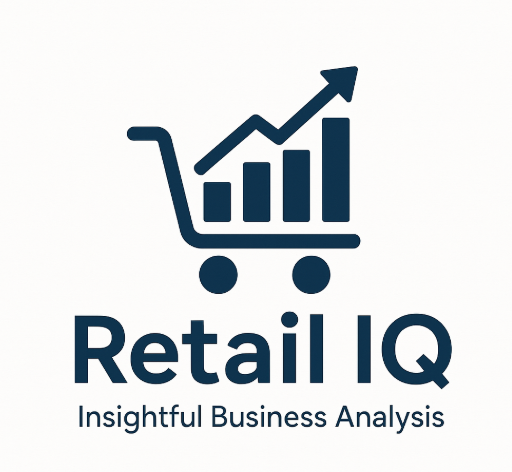

# 🛍️ Retail IQ – End-to-End Retail Analytics Dashboard



## 📌 Project Overview

Retail IQ is a comprehensive data analytics project that transforms raw retail transaction data into actionable insights. The project integrates data cleaning, exploratory data analysis (EDA), SQL querying, and interactive dashboards to support strategic business decisions in the retail domain.

---

## 🎯 Objectives

- Analyze sales and profit trends across product categories and regions
- Identify top and bottom-performing products and customer segments
- Assess the impact of discount strategies on profitability
- Create a real-time dashboard for business stakeholders

---

## 📈 Business Impact
- Automated reporting workflow using Power BI, reducing dependency on manual Excel reports  
- Enabled faster decision-making through real-time KPI dashboards  
- Identified high-discount products impacting profit margins  
- Highlighted top-performing regions contributing majority of revenue

---

## 📊 Key Insights
- Technology category generated highest profit but varied across regions  
- High discount levels negatively impacted overall profit margins  
- West region contributed the largest share of revenue  
- A small group of products contributed majority of total sales (Pareto effect)  
- Consumer segment generated most orders but lower profit margins

---

## ⚠️ Challenges Faced
- Handling missing and inconsistent data during preprocessing  
- Writing optimized SQL queries for KPI calculations  
- Designing efficient and responsive Power BI dashboards

---

## 🛠️ Tools & Technologies

| Tool        | Purpose                        |
|-------------|--------------------------------|
| Python (Pandas, Matplotlib, Seaborn) | Data Cleaning and EDA |
| SQL         | Business Logic & KPI Queries   |
| Power BI    | Interactive Dashboard & Visuals |
| Excel       | Initial Data Inspection        |

---

## 📊 Features & Insights

- Executive KPIs: Total Sales, Profit, Orders, Customers, Profit Margin
- Trend Analysis: Monthly Sales and Profit
- Product Analysis: Top 10 & Bottom 10 Products by Sales/Profit
- Customer Segments: Profitability by Segment
- Regional View: Sales and Profit by Region and State
- Discount Impact: How discounts affect margins

---

## 📁 Folder Structure
```plaintext
RetailIQ-Analytics/
├── assets/
│   ├── RetailIQ_Logo.png
│   └── dashboard_screenshots/
│
├── data/
│   └── cleaned_superstore.csv
│
├── excel/
│   └── Executive_Summary_Dashboard.csv
│
├── notebooks/
│   └── 01_Data_Cleaning_EDA.ipynb
│
├── powerbi/
│   ├── Retail IQ Dashboard.pdf
│   └── Retail_Sales_Dashboard.pbix
│
├── sql/
│   └── RetailIQ_SQL_Insights.sql
│
├── presentation/
│   └── RetailIQ-Analytics.pptx
│
├── README.md
└── requirements.txt
```

# 🚀 Retail IQ Dashboard Project

## 📈 Results

- Enhanced decision-making for product, customer, and region strategy  
- Delivered high-impact visuals through Power BI dashboard  
- Created reusable SQL logic for business KPIs  
- Packaged the project for portfolio, GitHub, and interview presentation  

## 📎 Links

- 📊 [Power BI Dashboard (PDF Export)](powerbi/Retail%20IQ%20Dashboard.pdf)  
- 💻 [Full Project on GitHub](https://github.com/MohammedAfrozeUddin/RetailIQ-Analytics/edit/main/RetailIQ-Analytics)  
- 👨‍💼 [Project Pitch Deck (PPT)](presentation/RetailIQ-Analytics.pptx)  

## 👤 Author

**Mohammed Afroze Uddin**  
📍 [Hyderabad](w), [India](w)  
📧 afrozeuddinmau@gmail.com  
🔗 [LinkedIn Profile](https://www.linkedin.com/in/mohammed-afroze-uddin/)
