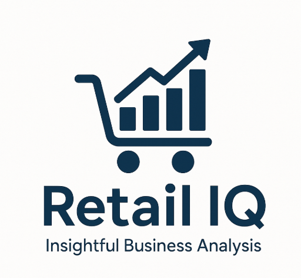

# 🛍️ Retail IQ – End-to-End Retail Analytics Dashboard

## 📌 Project Overview

Retail IQ is a comprehensive data analytics project that transforms raw retail transaction data into actionable insights. The project integrates data cleaning, exploratory data analysis (EDA), SQL querying, and interactive dashboards to support strategic business decisions in the retail domain.

---

## 🎯 Objectives

- Analyze sales and profit trends across product categories and regions
- Identify top and bottom-performing products and customer segments
- Assess the impact of discount strategies on profitability
- Create a real-time dashboard for business stakeholders

---

## 🛠️ Tools & Technologies

| Tool        | Purpose                        |
|-------------|--------------------------------|
| Python (Pandas, Matplotlib, Seaborn) | Data Cleaning and EDA |
| SQL         | Business Logic & KPI Queries   |
| Power BI    | Interactive Dashboard & Visuals |
| Excel       | Initial Data Inspection        |

---

## 📊 Features & Insights

- Executive KPIs: Total Sales, Profit, Orders, Customers, Profit Margin
- Trend Analysis: Monthly Sales and Profit
- Product Analysis: Top 10 & Bottom 10 Products by Sales/Profit
- Customer Segments: Profitability by Segment
- Regional View: Sales and Profit by Region and State
- Discount Impact: How discounts affect margins

---

## 📁 Folder Structure

RetailIQ-Analytics/
├── assets/
│ └── RetailIQ_Logo.png
│ └── dashboard_screenshots/
├── data/
│ └── cleaned_superstore.csv
├── excel/
│ └── Executive_Summary_Dashboard.csv
├── notebooks/
│ └── 01_Data_Cleaning_EDA.ipynb
├── powerbi/
│ └── Retail IQ Dashboard.pdf
│ └── Retail_Sales_Dashboard.pbix
├── sql/
│ └── RetailIQ_SQL_Insights.sql
├── presentation/
│ └── RetailIQ-Analytics.pptx
|── README.md
├── requirements.txt

# 🚀 Retail IQ Dashboard Project

## 📈 Results

- Enhanced decision-making for product, customer, and region strategy  
- Delivered high-impact visuals through Power BI dashboard  
- Created reusable SQL logic for business KPIs  
- Packaged the project for portfolio, GitHub, and interview presentation  

## 📎 Links

- 📊 [Power BI Dashboard (PDF Export)](powerbi/Retail%20IQ%20Dashboard.pdf)  
- 💻 [Full Project on GitHub]()  
- 👨‍💼 [Project Pitch Deck (PPT)](presentation/RetailIQ-Analytics.pptx)  

## 👤 Author

**Mohammed Afroze Uddin**  
📍 [Hyderabad](w), [India](w)  
📧 afrozeuddinmau@gmail.com  
🔗 [LinkedIn Profile](https://www.linkedin.com/in/mohammed-afroze-uddin/)
